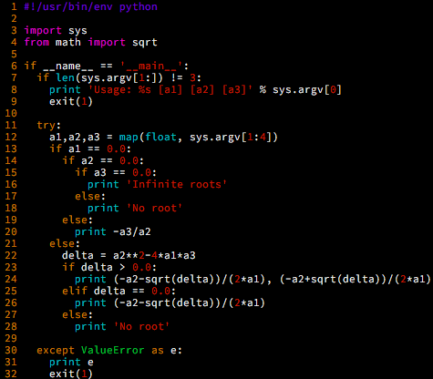
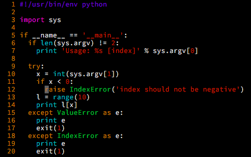

软件质量保证 第一次作业
===

@(软件质量保证)

等价类划分
---

### 理解问题

1. 一元二次方程的参数必须为**合法的浮点数形式**，比如`1.0`, `1e-3`等；
2. 一元二次方程的解有几种情况（保证$a_1 \neq 0$）：
	1. 两个不同解 $a_2^2>4a_1a_3$
	2. 一个解（或称为两个相同解） $a_2^2=4a_1a_3$
	3. 无解 $a_2^2<4a_1a_3$
3. 如果某些参数取到0值，方程的形式会改变：
	1. $a_1=0$，变为**一元一次方程**，有**唯一解**
	2. $a_1=0$与$a_2=0$，此时：
		1. $a_3=0$ 任意实数都是解
		2. $a_3\neq 0$ 方程不成立，**无解**

**代码实现**

- 使用python实现了完整的功能，从命令行参数接受输入，输出一行结果
- 错误格式会在处理输入的时候报出异常
- 正常的输出结果有：
	- 两个解：从小到大输出，空格分隔
	- 一个解：直接输出
	- 无解：输出`No root`
	- 无限解：输出`Infinite roots`

### 等价类划分生成

根据slides中的步骤来确定如何进行等价类划分：

**1. 确定输入域和输出：**
- 三个输入变量$a_1$，$a_2$，$a_3$，以字符串的形式输入，被转换为浮点数保存
- 输出结果为字符串，如果正常则以浮点数开头，如果出现异常则产生报错信息，或者指出解的特殊形式（无解或者无限解）

**2. 等价类划分：**
首先按照**合法输入**与**非法输入**进行划分：
- **合法输入**：三个可以被转换为浮点数的字符串
- **非法输入**：
	- `U1`：不够三个输入
	- `U2`：三个输入中任意一个是**无法转换为浮点数**的输入

合法输入中根据处理方式的不同划分等价类如下：
- `E1`: $a_1=0 \wedge a_2=0 \wedge a_3=0$
- `E2`: $a_1=0 \wedge a_2=0 \wedge a_3\neq 0$
- `E3`: $a_1=0 \wedge a_2\neq 0$
- `E4`: $a_1\neq 0 \wedge a_2^2>4a_1a_3$
- `E5`: $a_1\neq 0 \wedge a_2^2=4a_1a_3$ 
- `E6`: $a_1\neq 0 \wedge a_2^2<4a_1a_3$

**3. 组合等价类**

上面的划分是在笛卡尔积的基础上进行组合过的，因此这步跳过

**4. 确定不可测的等价类**

暂无

**5. 测试用例生成**

针对之前的每个等价类找出一个实例：

| 等价类标签	| 输入用例		| 输出结果				|
| ---		| ---			| ---					|
| $U_1$		| 只有一个输入	| 应输出Usage信息（见代码)	|
| $U_2$		| `a1 a2 a3` 	| 浮点数转换的异常信息		|
| $E_1$		| `0 0 0`		| `Infinite roots` 		|
| $E_2$ 	| `0 0 1`		| `No root` 				|
| $E_3$		| `0 2 1` 		| `-0.5` 				|
| $E_4$		| `1 1 0` 		| `-1.0 0.0` 			|
| $E_5$ 	| `1 -2 1.0`	 	| `1.0`					|
| $E_6$		| `1 2 3` 		| `No root` 				|

边界值分析
---

### 理解问题

线性表取值的一般代码为：

这里假设python中的list是链表实现（实际上是数组，但是这里不影响结果）。命令行中接受一个整数输入，输出LinkedList中的访问结果。如果x不在范围中，那么会抛出异常。

### 边界值分析

首先按照等价类划分的办法划分几个等价类：
- 非法输入：
	- $U_1$：输入个数小于1
	- $U_2$：输入为非法整型表示
- 合法输入：
	- $E_1$：$x<0$
	- $E_2$：$x\geq0 \wedge x\lt 10$
	- $E_3$：$x\geq 10$

然后**生成测试用例**：
- 对于非法输入，不用边界值分析，直接选取集合中的值即可
- 对于合法输入，分别选取边界附近值和边界值

| 等价类标签	| 输入用例		| 输出结果							|
| ---		| ---			| ---								|
| $U_1$		| 只有一个输入	| 应输出Usage信息（见代码)				|
| $U_2$		| `a1` 			| 整型转换的异常信息					|
| $E_1$		| `-1`			| `index should not be negative` 		|
| $E_2$ 	| `0`			| `0` 								|
| $E_2$		| `1` 			| `1` 								|
| $E_2$		| `9` 			| `9` 								|
| $E_3$ 	| `10`	 		| `list index out of range`			|
| $E_3$		| `11` 			| `list index out of range` 			|

